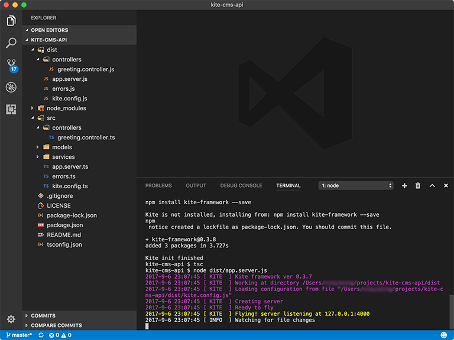

# Kite in action

Let's assume a scenario to build a reallife project: 

A set of content manage system (CMS) API that provides these functions:

* login
* create users
* list users
* assign role to a user
* compose article
* update article 
* update password

The system has 2 roles "administrator" and "editor", administrator has the privilege of
doing everything in this system, editor has the privilege of managing articles.

# Preparation

## Applications
In this project, we use [MongoDB](https://www.mongodb.org/) for data storage, 
please install it first (either a physical or a virtual machine).

Before we start this tutorial, we assume you have these package / application installed:

* [node](https://nodejs.org/) (ver 8.0+)
* [typescript](https://www.typescriptlang.org/) (ver 2.3+) 
* [visual studio code](https://code.visualstudio.com/) (any version)

## Project initialization
Install "kite-tools" (kite cli) from terminal for creating Kite modules 
(controller, model, service):

Linux / macOS:
```sh
sudo npm install kite-tools -g
```

Windows:
```sh
npm install kite-tools -g 
```

Create a folder for this project, and use Visual Studio Code (VSC) to open it.
Open the Integrated Terminal in VSC by menu entry "View > Integrated Terminal" or 
by shortcut [_^ \`_], type 

```sh
npm init
``` 
to create a "package.json" file step by step.

Then initialize Kite development environment for this project by command:

```sh
kite init
```

just simply press "enter" key to keep everthing in default value. 

After these steps, you can run "tsc" to compile the project:

```sh
tsc
```

If everything goes correctly, you can start the application server:

```sh
node dist/app.server.js
```

Now your project in VSC should look something like this:



## Dependencies

This project requires these javascript libraries:

* __mongodb__ - the official MongoDB driver for Node.js
* __jsonwebtoken__ - JSON Web Tokens (JWT) lib for encrypting / decrypting access token
* __bcrypt__ - lib to hash passwords

installation commands:

```sh
npm install mongodb jsonwebtoken bcrypt --save
```

Then we need install a dev-dependency to run compile script and app server in parallel:

```sh
npm install npm-run-all @types/bson --save-dev
```

after these dependencies are installed, add the following code to "[scripts](https://docs.npmjs.com/misc/scripts)" 
section of file "package.json":

```
"start": "run-p tsc:w server",
"tsc:w": "tsc -w",
"server": "node dist/app.server.js"
```

it means configure 3 script entries for this project:

* __start__ - run by the `npm start` command, calls `run-p` with 2 arguments "tsc:w" and "server", `run-p` will run these two scripts in parallel.
* __tsc:w__ - run `tsc` (typescript compiler) with option `-w` ([watch mode](https://www.typescriptlang.org/docs/handbook/compiler-options.html))
* __server__ - start our Kite application server

__run-p__ is a part of package [npm-run-all](https://github.com/mysticatea/npm-run-all) which is

> A CLI tool to run multiple npm-scripts in parallel or sequential.

now "package.json" look something like this:

```json
{
  "name": "kite-cms-api",
  "version": "1.0.0",
  "description": "Kite framework Content Managment System API example",
  "main": "dist/app.server.js",
  "scripts": {
    "test": "echo \"Error: no test specified\" && exit 1",
    "start": "run-p tsc:w server",
    "tsc:w": "tsc -w",
    "server": "node dist/app.server.js"
  },
  "repository": {
    "type": "git",
    "url": "git+https://github.com/kite-js/kite-cms-api.git"
  },
  "keywords": [
    "Kite",
    "framework",
    "examples"
  ],
  "author": "Arthur Xie",
  "license": "MIT",
  "bugs": {
    "url": "https://github.com/kite-js/kite-cms-api/issues"
  },
  "homepage": "https://github.com/kite-js/kite-cms-api#readme",
  "dependencies": {
    "bcrypt": "^1.0.3",
    "jsonwebtoken": "^7.4.3",
    "kite-framework": "^0.3.8",
    "mongodb": "^2.2.31"
  },
  "devDependencies": {
    "npm-run-all": "^4.1.1"
  }
}
```

Hit [^ + C] in terminal if previous Kite application is still running, then type

```sh
npm start
```

to start typescript compiler in watch mode and our application.

# Database design

MongoDB stores data in collections and documents, fields can vary from document to 
document and data structure can be changed over time, unlike SQL databases, we don't
need to design tables, just push document (JSON object) to it.

However, it's a good habit to design MongoDB documents in structured classes for your project:
* clarifying a document / table structure
* easily get code sugguestions from IDE
* filter input fields from client

## User Model

A user model is a class to map "user" document in database, and map some input fields
in user create / update APIs.

Manually create a file "user.model.ts" under "src/models" folder or use kite cli tools:

```sh
kite -m user
```

it has these properties (fields):

* ___id__ - user id, primary key
* __email__ - email for login
* __password__ - user password
* __nickname__ - public name for display
* __creationTime__ - user creation time
* __lastLoginTime__ - last login time

for details please refer to this code:

```typescript
import { Model, In } from 'kite-framework';
import { ObjectId } from 'bson';

@Model()
export class UserModel {
    /**
     * [NO INPUT]
     * user id
     * primary key for every document (user), create by MongoDB when document is inserted
     */
    _id: ObjectId;

    /**
     * [INPUT]
     * user email for login
     * 
     * Filter rules meaning:
     * - it's a required field when create / update a user
     * - validate this field by given pattern
     */
    @In({
        required: true,
        pattern: /^[a-z\d_\.\-]+@[a-z\d_\.\-]+\.[a-z]{2,}$/i
    })
    email: string;

    /**
     * [INPUT]
     * password
     * 
     * Filter rules meaning:
     * - it's a required field when create / update a user
     * - min length is restrict to 6
     */
    @In({
        required: true,
        min: 6
    })
    password: string;

    /**
     * [INPUT]
     * nickname for display
     * 
     * Filter rules meaning:
     * it's a required field when create / update a user
     */
    @In({
        required: true
    })
    nickname: string;

    /**
     * [NO INPUT]
     * user created time
     * set to current time when object is created
     */
    creationTime: Date = new Date();

    /**
     * [INPUT]
     * role id for this user
     * 
     * Filter rules meaning:
     * it's a required field when create / update a user
     */
    @In({
        required: true
    })
    roleId: number;
}
```

## Article Model

A article model is a class to map "article" document in database, and map some input fields
in article create / update APIs.


